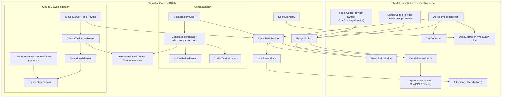

# Implementation plan — Windows AI Status Bar

This plan turns [`BRIEF.md`](BRIEF.md) into small, independently testable commits. It is written for an implementation agent working phase by phase without redesigning the architecture. Progress is tracked in [`PROGRESS.md`](PROGRESS.md).

Contents:

1. [How to use this plan](#1-how-to-use-this-plan)
2. [Reconnaissance findings (desk research)](#2-reconnaissance-findings-desk-research)
3. [Design changes relative to the brief](#3-design-changes-relative-to-the-brief)
4. [Target architecture](#4-target-architecture)
5. [State rules](#5-state-rules)
6. [Phases and commits](#6-phases-and-commits)
7. [Technical spikes](#7-technical-spikes)
8. [Undocumented-behaviour assumption register](#8-undocumented-behaviour-assumption-register)
9. [Known limitations to document](#9-known-limitations-to-document)

---

## 1. How to use this plan

**Commit IDs.** Every unit of work has an ID such as `P2.3`. One ID is normally one commit (a second commit for review fixes is fine). Commit messages start with the ID, for example `P2.3 Add Codex title resolver`.

**Markers.**

| Marker | Meaning |
| --- | --- |
| 🧑 | Requires Steve on his Windows machine. The agent prepares everything, then stops and lists exactly what Steve should do. |
| ⚠️ | Depends on undocumented behaviour. Cite the assumption ID (Section 8) in a code comment next to the rule that depends on it. |
| 🧪 | Spike: throwaway prototype that ends in a written decision, not production code. |

**Where code goes.**

- `core/StatusBar.Core` (net10.0, no WPF/WinForms/Windows APIs): models, parsers, state machines, timing rules, docking geometry, anything testable. **Prefer putting logic here.**
- Root WPF project `ClaudeUsageWidget.csproj` (net10.0-windows): windows, XAML, tray, DPAPI, Win32 interop, process activation, and thin adapters that wrap existing upstream services.
- `tests/StatusBar.Core.Tests`: xUnit tests for Core. Runs on Linux and Windows.
- `tests/ClaudeUsageWidget.SmokeTests`: upstream Windows-only smoke tests. Keep them passing; adjust when behaviour is intentionally changed.

**Definition of done for every commit.**

```bash
dotnet build WindowsAIStatusBar.slnx --nologo          # 0 errors, 0 warnings in Core
dotnet test tests/StatusBar.Core.Tests --nologo         # all green
```

Windows-only behaviour (windows, tray, DPI, focus, notifications) cannot be verified in a Linux session. For those commits, keep the Windows glue thin, push logic into Core with tests, and add the manual check to the phase's 🧑 acceptance list. CI on `windows-latest` builds, runs smoke tests and uploads a ready-to-run `status-bar-win-x64` artifact for Steve.

**Fixtures.** Hand-written or produced from `tools/recon` redacted samples. Never real prompts, transcripts, paths or IDs.

**Time.** All time-dependent code takes a `TimeProvider` (built into .NET 8+). Tests use `FakeTimeProvider` from the `Microsoft.Extensions.TimeProvider.Testing` package. Never call `DateTimeOffset.Now` in Core.

**Privacy rules for code.** Never log or persist prompt text, transcript content, tool arguments, file paths from sessions, tokens or account identifiers. Titles are kept in memory only and truncated. Log messages use IDs shortened to 8 characters and counts.

---

## 2. Reconnaissance findings (desk research)

These findings come from reading source code on 2026-09-28. Findings about Steve's own machine (Phase 0, items 3–8 of the brief) cannot be gathered from a cloud session; `tools/recon/Collect-Recon.ps1` collects them (see [`recon/README.md`](recon/README.md)).

### 2.1 AIUsageWidget (upstream v2.1.1)

The codebase is small (about 4,500 lines) and well-behaved. It builds unchanged on .NET 10; the whole solution also compiles on Linux with `EnableWindowsTargeting`.

| File | Role today | Decision |
| --- | --- | --- |
| `CodexAppServerClient.cs` (+ `CodexLocator`) | JSON-RPC over stdio to `codex app-server`; locates ChatGPT-bundled Codex | **Retain unchanged.** |
| `ChatGptUsageService.cs` (+ `ChatGptUsageParser`) | `account/read`, `account/rateLimits/read`, browser login | **Retain.** Wrap in `CodexUsageProvider` adapter. |
| `AnthropicOAuth.cs`, `UsageService.cs`, `TokenStore.cs`, `LoginWindow.*` | Claude PKCE login, refresh, DPAPI tokens, usage fetch | **Retain.** Wrap in `ClaudeUsageProvider` adapter. |
| `UsageModels.cs` (`UsageBucket`, `UsageParser`) | Normalized row + Claude parser + countdown formatting | **Retain**; map `UsageBucket` → Core `UsageWindow` in adapters. |
| `App.xaml.cs` (758 lines) | Composition root, tray, updater UI, **single "active provider" fetch loop** | **Modify substantially.** Replace the active-provider loop with Core `UsageMonitor` (both providers refresh independently). Split tray into `TrayController`. |
| `MainWindow.xaml(.cs)` | Floating card with provider tabs, bars, drag-move, edge-drag scaling | **Replace** with `StatusStripWindow` + `DetailsPaneWindow`. Salvage theme brushes and the `WM_DISPLAYCHANGE` hook. |
| `WindowPlacement.cs` | Off-screen recovery, top-right placement | **Replace** with Core `DockGeometry` (tested) + WPF `DockController`. |
| `Settings.cs` (+ `AutoStart`) | JSON settings, Startup-folder shortcut | **Modify**: new settings; rename shortcut; keep mechanism. |
| `AppPaths.cs` | `%APPDATA%\ClaudeUsageWidget` resolution | **Modify**: new folder `WindowsAIStatusBar`, one-time token import. |
| `DiagnosticsService.cs` | Redacted clipboard report | **Extend** with task-provider health and format-drift counters. |
| `Log.cs` | 512 KB rolling text log | **Retain**; add category helper. Existing messages are in Chinese; leave them. |
| `Localization.cs` | zh-Hant/English table; missing keys render as the key | **Retain.** Every new key needs an entry (English text may be duplicated into the zh slot). |
| `ThemeManager.cs`, `TrayIconRenderer.cs` | Colours, tray icon ring | **Retain**; tray icon may later show attention count. |
| `UpdateService.cs` | GitHub-release self-update | **Retain.** Already repointed to this fork during setup. Asset name changes in P1.1. |
| `SettingsWindow.*` | Language, theme, interval, Codex path, opacity | **Extend.** |

Important behaviours to preserve: Claude 429 back-off, keeping the last good values when a refresh fails (`ShowStaleData`), token refresh on 401, Codex child-process restart, and never logging Codex stdout/stderr.

### 2.2 ProjectNeura/agent-dashboard (Codex reference)

Rust; reads only the newest rollout under `$CODEX_HOME/sessions` (default `~/.codex/sessions`), tail 3 MB, every 650 ms. Rules:

- `event_msg` + `payload.type == "task_started"` → working.
- `task_complete` or `turn_aborted` → stopped; clears pending approvals.
- `response_item` + `function_call` whose `name == "request_user_input"` **or** whose JSON `arguments` contain `"sandbox_permissions": "require_escalated"` → pending, keyed by `call_id`.
- `function_call_output` with the same `call_id` → resolved.
- Working + any pending → waiting.

We adopt these rules, but for **all** recent sessions (not only the newest), incrementally rather than by re-reading the tail.

### 2.3 Codex source facts (openai/codex, `codex-rs`)

- Rollouts live in `$CODEX_HOME/sessions/YYYY/MM/DD/rollout-<timestamp>-<uuid>.jsonl`.
- **Rollouts older than 7 days are compressed** to `.jsonl.zst` (`rollout/src/compression.rs`, `MIN_ROLLOUT_AGE`). Only read `.jsonl`; ignore `.zst`.
- `event_msg` types persisted: `task_started` (alias `turn_started`), `task_complete` (alias `turn_complete`), `turn_aborted` (reasons `interrupted`, `replaced`, `review_ended`, `budget_limited`), `token_count`, and others.
- **Not persisted**: `ExecApprovalRequest`, `ApplyPatchApprovalRequest`, `RequestUserInput`, `RequestPermissions`, `ElicitationRequest`, and `Error`. Approval/input waits therefore **cannot be read directly** from the file; they must be inferred from a pending tool call. Failures cannot be confirmed from the file either, apart from `turn_aborted`.
- A newer **paginated history mode** stores `event_msg` / `item_completed` records with turn items instead of `response_item` records. Which mode Steve's ChatGPT app writes must be confirmed in recon (spike S2).
- `session_meta` carries `id`, `cwd`, `originator`, `cli_version`, `source` (`cli`, `vscode`, `exec`, `mcp`, custom, internal, or **sub-agent**).
- `turn_context` carries `approval_policy` and `sandbox_policy`.
- `$CODEX_HOME/session_index.jsonl` is an append-only list of `{id, thread_name, updated_at}`; the latest entry per ID wins. This is the best local source for user-visible thread titles.
- The app-server (already used for quotas) offers `thread/list` with `name`, `preview`, `updatedAt` and a `status` (`notLoaded`, `idle`, `systemError`, `active{activeFlags: waitingOnApproval | waitingOnUserInput}`). **Status only reflects threads loaded in that app-server process**, so it does not show the ChatGPT app's own running threads. It remains a documented source of titles (spike S7).

### 2.4 ClaudeLift (Cowork reference)

- Roots on Windows: `%APPDATA%\Claude\local-agent-mode-sessions` **and** every `%LOCALAPPDATA%\Packages\Claude_*\LocalCache\Roaming\Claude\local-agent-mode-sessions` (MSIX installs). The two can hold different subsets of the same tasks; merge by task ID and prefer the record with an `audit.jsonl`.
- Layout: `<root>/<account-uuid>/<workspace-uuid>/local_<task-uuid>.json` (metadata) and `.../local_<task-uuid>/` (task directory) containing `audit.jsonl`, `uploads/`, `outputs/`, `.claude/projects/...` (the latter is empty on Windows). `spaces.json` sits in each workspace.
- Metadata keys used by ClaudeLift: `sessionId`, `title`, `model`, `cliSessionId`, `cwd`, `initialMessage`, `userSelectedFolders`, `createdAt` (ms), `lastActivityAt` (ms), `isArchived`, `error`.
- `audit.jsonl` records look like **Claude Agent SDK stream messages**: `type` = `system` (subtype `init`), `assistant`, `user`, `result`, with `message.content` blocks (`text`, `tool_use`, `tool_result`, `thinking`) and an `_audit_timestamp`. Windows writes each user prompt twice. If `result` records are written per turn, they give a **confirmed completion signal**, and a pending `AskUserQuestion` `tool_use` gives a strong **needs-input signal**. Both must be verified (assumptions A-C3 to A-C5).
- ClaudeLift uses a file watcher at depth 2 with a 500 ms debounce and root rediscovery every 60 s.

### 2.6 Claude Code (added 2026-09-28)

Steve works mostly in Claude Code, in the Claude desktop app's Code tab and in terminals. Relevant facts:

- Sessions are written as JSONL transcripts to `~/.claude/projects/<encoded-working-folder>/<session-id>.jsonl` (the folder can be moved with the `CLAUDE_CONFIG_DIR` environment variable). The format is not formally documented but is stable in practice and widely parsed by community tools (ClaudeLift reads it, including `ai-title` records for titles). Records carry `type` (`user`, `assistant`, `system`, `summary`, `ai-title`, …), `sessionId`, `cwd`, `timestamp`, `uuid`, `isSidechain` (sub-agents) and `message` (with `stop_reason` on assistant records).
- A transcript does **not** record permission prompts; the prompt appears only in the UI.
- Claude Code **hooks are documented and supported**. A command configured in `~/.claude/settings.json` receives JSON on stdin for events such as `UserPromptSubmit`, `Stop`, `Notification` (with `notification_type`, e.g. `permission_prompt`, `idle_prompt`, `elicitation_dialog`) and `SessionEnd`. Common fields are `session_id`, `transcript_path`, `cwd` and `hook_event_name`. `UserPromptSubmit` also carries the prompt text, which must never be stored.
- Whether sessions started from the desktop Code tab use the same transcript folder and run user hooks is to be confirmed on Steve's PC (A-K1, A-K4).

### 2.5 Windows notification listener

`Windows.UI.Notifications.Management.UserNotificationListener` requires **package identity** and the `userNotificationListener` capability. For an unpackaged WPF app, identity can be obtained with a *sparse package* (MSIX "packaging with external location"), which must be signed with a certificate trusted on the machine. The project would also need a Windows-specific TFM (for example `net10.0-windows10.0.19041.0`) for the WinRT projections. The user must grant access once. Some community reports indicate that the `NotificationChanged` event is unreliable for non-UWP apps, in which case `GetNotificationsAsync` must be polled. This is a significant packaging cost for evidence that is incomplete by design (Claude does not toast when its window is in focus). See design change D5 and spike S5.

---

## 3. Design changes relative to the brief

Steve asked for suggestions before implementation. The following changes are **adopted by this plan unless Steve vetoes them**. Each is small and keeps to the brief's intent.

| ID | Change | Reason |
| --- | --- | --- |
| **D1** | Put all non-UI logic in a separate platform-neutral `StatusBar.Core` library. | Parsers and state rules are the fragile, high-value part. Keeping them free of WPF lets tests run on Linux CI and in cloud agent sessions, where the implementation agent works. |
| **D2** | Phase 0 machine inspection is done by Steve running `tools/recon/Collect-Recon.ps1`, which records structure only (all free text redacted) plus an optional live timeline while he performs scripted scenarios. | A cloud agent cannot see Steve's machine. The timeline shows exactly which records appear when an approval is requested or answered, which is the evidence the state rules need. |
| **D3** | Codex attention is inferred from pending tool calls, with a short debounce (3 s) and suppression when the turn's `approval_policy` is `never`. *Recon (2026-09-28): Steve runs with `approval_policy: never`, so in practice only "waiting for your input" applies.* | Codex does not write approval requests to disk (2.3). Auto-approved escalations would otherwise flash a false alert. |
| **D4** | Claude state comes primarily from **`audit.jsonl`** records (init → Working, `result` → Complete/Failed, unanswered `system/permission_request` → NeedsAttention), with metadata recency as the fallback. | Recon confirmed explicit `permission_request`/`permission_response` records, including for `AskUserQuestion`. It is undocumented, so contract tests cover it. |
| **D5** | The Windows notification listener is **dropped from v1**. The architecture keeps an `IClaudeAttentionEvidenceSource` seam so it can be added later without redesign. | Recon showed `audit.jsonl` records permission prompts directly (A-C6 confirmed), so the packaging, signing and TFM cost is not justified. |
| **D6** | Both usage providers refresh **independently and continuously**. The upstream "active provider" tab model is removed. | The strip shows both allowances at once; upstream only fetched the selected provider. |
| **D7** | ~~The compact percentage for each provider is the tightest window.~~ **Revised 2026-09-28 at Steve's request:** the strip shows each provider's **session (5-hour) window**, chosen as the shortest window with a known length (`UsageSummary.Compact`), falling back to the tightest window if no length is known. The pane shows all windows. | The session figure is the one Steve acts on day to day, and it is comparable across both providers. A nearly exhausted weekly limit is visible in the pane. |
| **D8** | The expanded pane is a **separate window** placed above the strip. The strip never moves or resizes when the pane opens. | Simpler docking, no layout jumps, and closing on deactivation ("click elsewhere") comes for free. |
| **D9** | Remove drag-to-move and edge-drag scaling from the strip. Position is anchored; scale stays as a setting. | A docked strip that can be dragged fights its own docking logic. |
| **D10** | New product identity: assembly `AIStatusBar`, data folder `%APPDATA%\WindowsAIStatusBar`, new mutex and Startup shortcut names; **one-time import** of the upstream `tokens.dat` so Claude stays signed in. The C# namespace `ClaudeUsageWidget` stays for now. | Lets upstream AI Usage Widget and this app coexist, and avoids a noisy rename of every file. |
| **D11** | Attention notifications use the existing tray `NotifyIcon.ShowBalloonTip` (shown as a normal Windows toast), not the WinRT toast API. | Works unpackaged with no new dependencies. |
| **D12** | Sub-agent Codex sessions (`session_meta.source` = sub-agent) are folded into their parent task, not counted separately. | Otherwise one Codex job with helpers would show as several tasks. Verify in recon (A-X6). |
| **D13** | "Aborted by user" (`turn_aborted`, reason `interrupted`) maps to `Complete` with detail "Stopped", not `Failed`. | The brief reserves `Failed` for reliable error states, and Codex does not persist errors. |
| **D14** | Add a small `StatusDetail` string to `AgentTask` (e.g. "Stopped", "Waiting for approval"), shown only in the pane tooltip. | Gives the pane useful context without adding enum states. |
| **D15** | **Decided by Steve 2026-09-28.** A completed turn whose final assistant message ends with a question is shown as `NeedsAttention / Inferred`, reason "Asked you a question". The check reads only the final message on the turn's terminal record (Codex `task_complete.last_agent_message`, Cowork `result.result`), computes one boolean in memory, and discards the text. | Both apps normally ask questions in plain text at the end of a turn rather than through structured prompts (recon follow-up), so structured-prompt rules alone would miss most real questions. |
| **D16** | **Decided with Steve 2026-09-28: Claude Code, not Cowork, is Steve's main Claude surface** (desktop Code tab and terminal). The Claude task provider is rebuilt around Claude Code: its session transcripts under `~/.claude/projects` give discovery, titles and turn state, and Claude Code's **documented hooks** (opt-in) give confirmed "needs permission / needs input / finished" events. Cowork moves to an optional Phase 4. | Steve's live Cowork test showed no local activity, and Claude Code hooks are the supported mechanism for external status tools that the brief referred to. |

---

## 4. Target architecture

### 4.1 Component diagram



### 4.2 Folder layout (end state)

```
core/StatusBar.Core/
  Common/        Clock helpers, Debouncer, ProviderHealth, TextSanitizer
  IO/            IncrementalJsonlReader, TailReader, DirectoryWatcher
  Usage/         UsageWindow, UsageSnapshot, UsageSummary, UsageMonitor, IUsageProvider, exceptions
  Tasks/         AgentTask (exists), IAgentTaskProvider, AgentStateService, StatusBarState,
                 NotificationGate, DismissalStore, DemoTaskProvider
  Codex/         CodexPaths, CodexRolloutParser, CodexSessionState, CodexTitleResolver,
                 CodexSessionReader, CodexTaskProvider
  Claude/        ClaudeCodePaths, ClaudeCodeTranscriptParser, ClaudeCodeSessionState,
                 ClaudeHookEventParser, ClaudeSettingsHookMerger, ClaudeCodeTaskProvider,
                 CoworkRootLocator, CoworkTaskStoreReader, CoworkTaskMetadata,
                 CoworkAuditParser, CoworkAuditState, ClaudeStateResolver,
                 IClaudeAttentionEvidenceSource, ClaudeCoworkTaskProvider
  Docking/       DockGeometry, DockAnchor
  Diagnostics/   FormatDriftCounter, TaskDiagnostics
tests/StatusBar.Core.Tests/
  <same folders>, Contract/ (format contract tests), Fixtures/codex, Fixtures/cowork
(root WPF project)
  StatusStripWindow.xaml(.cs), DetailsPaneWindow.xaml(.cs), TaskRowView (code-built rows),
  DockController.cs, TrayController.cs, AppActivator.cs, AttentionNotifier.cs,
  Providers/ClaudeUsageProvider.cs, Providers/CodexUsageProvider.cs, app.manifest
```

### 4.3 Core interfaces (exact signatures)

The implementation agent should create these as written. Adding members is fine; changing existing ones needs a note in `PROGRESS.md`.

```csharp
// ---------- Usage ----------
namespace StatusBar.Core.Usage;

public enum UsageSource { Codex, Claude }

/// <summary>One quota window, e.g. "5h" or "Weekly". UsedPercent is 0–100.</summary>
public sealed record UsageWindow(string Key, string Label, double UsedPercent, DateTimeOffset? ResetsAt)
{
    public double RemainingPercent => Math.Clamp(100 - UsedPercent, 0, 100);
}

public enum UsageHealth { Loading, Ok, Stale, SignedOut, Unavailable }
public enum AllowanceLevel { Normal, Approaching, Low }

public sealed record UsageSnapshot(
    UsageSource Source,
    IReadOnlyList<UsageWindow> Windows,   // last good values; empty if never succeeded
    UsageHealth Health,
    DateTimeOffset? LastSuccess,
    string StatusCode);                   // diagnostic code, e.g. "Ready", "RateLimited"

public interface IUsageProvider
{
    UsageSource Source { get; }
    /// <summary>Throws UsageAuthRequiredException, UsageRateLimitedException or any other exception on failure.</summary>
    Task<IReadOnlyList<UsageWindow>> FetchAsync(CancellationToken cancellationToken);
}

public sealed class UsageAuthRequiredException(string message, Exception? inner = null) : Exception(message, inner);
public sealed class UsageRateLimitedException(TimeSpan? retryAfter) : Exception("Rate limited")
{
    public TimeSpan? RetryAfter { get; } = retryAfter;
}

public static class UsageSummary
{
    /// <summary>The window with the lowest remaining percentage (design change D7), or null.</summary>
    public static UsageWindow? Principal(IReadOnlyList<UsageWindow> windows);
    /// <summary>Normal ≥ 30 % remaining, Approaching 10–30 %, Low &lt; 10 % (thresholds from settings).</summary>
    public static AllowanceLevel Level(double remainingPercent, double approachingBelow = 30, double lowBelow = 10);
}

/// <summary>Runs one independent refresh loop per provider with back-off (base interval, ×2 on
/// failure up to 600 s, honours RetryAfter), keeps last good windows, raises Changed.</summary>
public sealed class UsageMonitor : IAsyncDisposable
{
    public UsageMonitor(IEnumerable<IUsageProvider> providers, TimeProvider time, Func<TimeSpan> baseInterval);
    public event Action<UsageSnapshot>? Changed;       // raised on a thread-pool thread
    public IReadOnlyDictionary<UsageSource, UsageSnapshot> Current { get; }
    public void Start();
    public void RefreshNow(UsageSource? source = null);
}

// ---------- Tasks ----------
namespace StatusBar.Core.Tasks;

public enum ProviderHealthState { Starting, Ok, Degraded, Unavailable }
public sealed record ProviderHealth(ProviderHealthState State, string Code, DateTimeOffset? LastEvidence);

public sealed record ProviderTaskSnapshot(
    AgentProvider Provider,
    IReadOnlyList<AgentTask> Tasks,       // tasks this provider considers relevant now
    ProviderHealth Health);

public interface IAgentTaskProvider : IAsyncDisposable
{
    AgentProvider Provider { get; }
    /// <summary>Raised whenever the provider's normalized view changes. Never raised with content text.</summary>
    event Action<ProviderTaskSnapshot>? Changed;
    void Start();
    /// <summary>Forces discovery and reconciliation now (used after resume from sleep and in tests).</summary>
    Task ReconcileAsync(CancellationToken cancellationToken = default);
    ProviderTaskSnapshot Current { get; }
}

/// <summary>Immutable state for the UI. Ordering: NeedsAttention, Working, Unknown, recently Complete/Failed.</summary>
public sealed record StatusBarState(
    IReadOnlyList<AgentTask> Tasks,
    int WorkingCount,
    int AttentionCount,
    IReadOnlyDictionary<AgentProvider, ProviderHealth> TaskProviderHealth);

public sealed class AgentStateService
{
    public AgentStateService(IEnumerable<IAgentTaskProvider> providers, TimeProvider time, StateServiceOptions options);
    public event Action<StatusBarState>? StateChanged;                 // only when something visible changed
    public event Action<AgentTask>? EnteredNeedsAttention;            // after NotificationGate de-duplication
    public StatusBarState Current { get; }
    public void Dismiss(string taskId);                               // manual acknowledgement (Claude uncertain alerts)
}

public sealed record StateServiceOptions(
    TimeSpan RecentlyCompletedFor,      // default 10 min
    TimeSpan UnknownVisibleFor);        // default 30 min; Unknown tasks then drop out

// ---------- Claude evidence seam (design change D5) ----------
namespace StatusBar.Core.Claude;

public sealed record ClaudeAttentionEvidence(string? TaskIdHint, string? TitleHint, DateTimeOffset ObservedAt, string EvidenceKey);

public interface IClaudeAttentionEvidenceSource
{
    event Action<ClaudeAttentionEvidence>? EvidenceObserved;
}
```

`AgentTask` gains one optional property (design change D14): `public string? StatusDetail { get; init; }`.

### 4.4 Threading model

Providers and `UsageMonitor` raise events on thread-pool threads. `AgentStateService` serialises its work with a `SemaphoreSlim` or a single-reader `Channel`. The WPF layer subscribes and marshals with `Dispatcher.BeginInvoke`. Core never touches the dispatcher. Watchers debounce bursts (250 ms) so a busy session causes at most a few UI updates per second, and the UI updates only when `StatusBarState` actually differs (records give value equality; compare lists element-wise).

---

## 5. State rules

Timing constants live in one `TaskTimings` record so they can be tuned from settings or tests.

| Constant | Default | Used for |
| --- | --- | --- |
| `ReconcileInterval` | 20 s | Periodic directory rescan (both providers) |
| `WatcherDebounce` | 250 ms | Coalesce file events |
| `CodexApprovalDebounce` | 3 s | Pending escalated call must stay pending this long before NeedsAttention |
| `CodexWorkingStaleAfter` | 20 min | Working with no new records → Confidence `Stale` |
| `CodexWorkingUnknownAfter` | 2 h | → Status `Unknown` |
| `CodexRecentFileWindow` | 24 h | Only files modified within this window are tracked |
| `ClaudeRecentActivityWindow` | 2 min | Metadata-only recency → `Working/Inferred` |
| `ClaudeWorkingStaleAfter` | 15 min | Working with no audit/metadata change → `Stale` |
| `ClaudeInferredAttentionExpiry` | 30 min | Inferred alert with no new evidence → `Unknown/Stale` |
| `ClaudeConfirmedAttentionExpiry` | 2 h | Confirmed alert with no new evidence → `Unknown/Stale` |
| `QuestionAttentionExpiry` | 4 h | "Asked you a question" flag (D15) is dropped and the task shows as `Complete` |
| `RecentlyCompletedFor` | 10 min | Complete/Failed tasks visible in the pane |
| `UnknownVisibleFor` | 30 min | Unknown tasks visible in the pane |

### 5.1 Codex (per rollout file) ⚠️ A-X1…A-X7

Parser input is one JSONL line at a time; unknown record types are counted in `FormatDriftCounter` and otherwise ignored. Malformed lines are counted and skipped.

| Record | Effect on `CodexSessionState` |
| --- | --- |
| `session_meta` | Set `ThreadId` (`payload.id`), `Source`, `ParentThreadId` when sub-agent, `CwdLeaf` (last path segment only), `StartedAt`. |
| `turn_context` | Set `ApprovalPolicy` (string). |
| `event_msg/task_started` or `turn_started` | `Turn = Running`, clear pending, `LastActivity = ts`. |
| `event_msg/task_complete` or `turn_complete` | If `payload.error` is a non-null object → `Turn = Failed` (recon 2026-09-28: `{message, codex_error_info}`; never read or log the message). Otherwise `Turn = Completed` and set `EndedWithQuestion = QuestionDetector.EndsWithQuestion(payload.last_agent_message)` (D15; text discarded immediately). Clear pending. |
| `event_msg/turn_aborted` | `Turn = Aborted`, record reason, clear pending. |
| `response_item/function_call` where `name == "request_user_input"` | Add pending `{call_id, kind: Input, since: ts}`. |
| `response_item/function_call` whose `arguments` JSON has `sandbox_permissions == "require_escalated"` | Add pending `{call_id, kind: Approval, since: ts}`. |
| `response_item/function_call_output` (or `custom_tool_call_output`) | Remove pending by `call_id`. |
| `response_item/custom_tool_call` (`name: "exec"`, free-form `input`) | Activity only. Never read or store `input`. |
| `event_msg/item_completed` (paginated history; item types `AgentMessage`, `CommandExecution`, `FileChange`, `McpToolCall`, `Reasoning`, `UserMessage`, `DynamicToolCall`) | Activity only; a `UserMessage` item is also a title candidate. Rollouts on Steve's PC contain **both** these and `response_item` records (recon 2026-09-28). |
| `world_state`, `token_usage_record`, `event_msg/token_count`, `event_msg/thread_settings_applied` | Activity only. |
| first user message (`response_item/message` role `user`, or legacy `event_msg/user_message`) | Offer to `CodexTitleResolver` as a title candidate (sanitised immediately; raw text discarded). |
| any record | `LastActivity = ts` (fall back to file write time if `timestamp` missing). |

Mapping to `AgentTask` at evaluation time `now`:

1. `Turn == Running` and a pending item exists with `now - since ≥ CodexApprovalDebounce` and `ApprovalPolicy != "never"` → `NeedsAttention / Inferred`, reason "Waiting for approval" or "Waiting for your input". (Inferred because the approval event itself is not on disk.)
2. `Turn == Running` → `Working / Confirmed`; if `now - LastActivity ≥ CodexWorkingStaleAfter` → `Working / Stale`; if `≥ CodexWorkingUnknownAfter` → `Unknown / Stale`.
3. `Turn == Completed` and `EndedWithQuestion` and `now - LastActivity < QuestionAttentionExpiry` → `NeedsAttention / Inferred`, reason "Asked you a question", evidence key = `turn_id` (D15). Otherwise `Turn == Completed` → `Complete / Confirmed`. `Turn == Failed` → `Failed / Confirmed`. `Turn == Aborted` → `Complete / Confirmed`, `StatusDetail = "Stopped"` (D13).
4. No turn seen yet (tail read began mid-file with no `task_started`) → derive from the most recent turn event in the tail; if none, `Unknown / Stale`.

Sub-agent sessions (D12): their state is merged into the parent task (parent is `Working` if any child is working; `NeedsAttention` if any child needs attention). If the parent cannot be found, show the child with the title "Codex sub-task".

Title precedence (`CodexTitleResolver`): `session_index.jsonl` latest `thread_name` for the ID → first genuine user message (skip messages starting with `<environment_context>`, `<user_instructions>`, `<permissions`, `# AGENTS.md`, or similar injected blocks; take the first line; collapse whitespace; strip Markdown symbols; truncate to 48 characters at a word boundary with "…") → `"Codex · " + CwdLeaf` → `"Codex task"`.

### 5.2 Claude Cowork (per task) ⚠️ A-C1…A-C8

`CoworkAuditParser` builds `CoworkAuditState` from `audit.jsonl`:

| Record | Effect |
| --- | --- |
| `system/init` | `Turn = Running`, clear pending. |
| `assistant` | `Turn = Running` (if not already); for each `tool_use` block add pending `{id, name, since}`. |
| `user` | For each `tool_result` block remove pending by `tool_use_id`. A user text message after `result` also means `Turn = Running`. |
| `result` with `subtype == "success"` and `is_error != true` | `Turn = Completed`, clear pending, set `EndedWithQuestion = QuestionDetector.EndsWithQuestion(result)` (D15; text discarded immediately). |
| `result` with `is_error == true` or `subtype` starting `error` | `Turn = Failed`, clear pending. |
| `system/permission_request` | Add pending permission `{uuid, tool_name, since}`. ⚠️ A-C6 (confirmed 2026-09-28) |
| `system/permission_response` | Resolve the oldest pending permission with the same `tool_name` (the request and response `uuid`s are not guaranteed to match). |
| `system/status`, `system/thinking_tokens`, `command_lifecycle`, `rate_limit_event` | Activity only (`Turn = Running` if a run has started). |
| any | `LastActivity = _audit_timestamp` (or `timestamp`), else file write time. |

Duplicate user prompts (Windows writes them twice) do not matter for state because they only touch `LastActivity`.

`ClaudeStateResolver` combines, in this order:

1. **Metadata** — `isArchived == true` → hide. Non-empty `error` → `Failed / Confirmed`.
2. **Audit** (if readable):
   - pending permission request → `NeedsAttention / Confirmed`, reason by `tool_name`: `AskUserQuestion` → "Waiting for your answer", `ExitPlanMode` → "Plan needs approval", anything else → "Permission requested". Evidence key = request `uuid`.
   - pending `AskUserQuestion`/`ExitPlanMode` `tool_use` without a permission request (older app versions) → `NeedsAttention / Inferred`.
   - `Turn == Running` → `Working / Confirmed` (stale/unknown rules as in the table).
   - `Turn == Completed` and `EndedWithQuestion` and within `QuestionAttentionExpiry` → `NeedsAttention / Inferred`, reason "Asked you a question" (D15); otherwise `Complete / Confirmed`. `Failed` → `Failed / Confirmed`.
3. **External evidence** (`IClaudeAttentionEvidenceSource`, only if implemented) — matched to a task by `TaskIdHint`, else by exact title match, else to the single most recently active Working Claude task; otherwise ignored. → `NeedsAttention / Inferred`, reason "Claude sent a notification".
4. **Recency fallback** (no readable audit) — `lastActivityAt` or metadata write time within `ClaudeRecentActivityWindow` → `Working / Inferred`, `StatusDetail = "Active recently"`; older → not shown unless it was shown before, in which case `Unknown / Stale` for `UnknownVisibleFor`.

**Attention clearing** (brief §16), implemented in `ClaudeStateResolver` and `AgentStateService`:

1. A matching `system/permission_response`, or any audit record showing resumed work after the trigger (`tool_result`, new `assistant` record, `system/status`), clears it → `Working`.
2. A `result` record clears it → `Complete`/`Failed`. A question flag (D15) is cleared by the next turn starting (Codex `task_started`, Cowork `system/init` or a new user record), by Dismiss, or after `QuestionAttentionExpiry`, when the task shows as `Complete`.
3. Steve can dismiss a Claude alert from the pane. `DismissalStore` records `(taskId, evidenceKey)`; the same evidence never re-raises, a new trigger does. Dismissals are kept in memory and in the small state file for 24 h.
4. Unresolved alerts expire: Inferred after `ClaudeInferredAttentionExpiry`, Confirmed after `ClaudeConfirmedAttentionExpiry`, to `Unknown / Stale` with `StatusDetail = "No recent activity"`. Never to `Complete`.

### 5.3 Claude Code (per session) ⚠️ A-K1…A-K4

**Transcript records** (`ClaudeCodeTranscriptParser`, incremental like Codex):

| Record | Effect |
| --- | --- |
| `user` with text content that is not a `tool_result`, not `isMeta`, and not a slash-command wrapper | `Turn = Running`, clear question flag and pending; first one is a title candidate (sanitised, never stored in full). |
| `user` whose text starts with `[Request interrupted by user` | `Turn = Aborted` (`StatusDetail = "Stopped"`). ⚠️ A-K3 |
| `user` with `tool_result` blocks | Resolve pending tool ids. |
| `assistant` | `Turn = Running`; add pending for each `tool_use`. If `message.stop_reason == "end_turn"` → `Turn = Completed`, `EndedWithQuestion = QuestionDetector.EndsWithQuestion(last text block)` (D15). |
| `custom-title` | Title shown in the desktop Code tab; preferred over everything else. Field name to be confirmed from a fixture (recon 2026-09-28 saw the record type only). |
| `ai-title` (`aiTitle`) | Title (preferred over the first prompt). |
| `last-prompt`, `attachment`, `agent-name`, `bridge-session`, `atis-latch` | Activity only (seen in recon 2026-09-28). Never read `last-prompt` content. |
| any record with `isSidechain: true` | Activity for the parent session only (sub-agent; D12 analogue). |
| everything else (`system`, `summary`, `file-history-snapshot`, …) | Activity only. |

**Hook events** (`ClaudeHookEventParser`, reading the app's own `claude-hooks.jsonl`, see P3.2). These are documented and therefore `Confirmed`:

| Hook event | Effect |
| --- | --- |
| `UserPromptSubmit` | `Working / Confirmed`; clears attention. |
| `Notification` with `notification_type == "permission_prompt"` | `NeedsAttention / Confirmed`, reason "Permission requested", evidence key = session id + event timestamp. |
| `Notification` with `notification_type == "elicitation_dialog"` | `NeedsAttention / Confirmed`, reason "Waiting for your input". |
| `Notification` with `idle_prompt` | Ignored (it fires after every finished turn that is left idle; D15 covers real questions). |
| `Stop` | `Complete / Confirmed` (question flag still comes from the transcript). |
| `SessionEnd` | `Complete`; the session drops out after `RecentlyCompletedFor`. |

**Combining.** The newest evidence wins. A permission alert from a hook is cleared by any later transcript record for that session (the tool ran, or Claude continued) or by the next hook event. Without hooks the provider uses transcripts only: permission waits then show as `Working` (documented limitation), and everything else still works.

### 5.4 Notification de-duplication (`NotificationGate`)

A notification fires only when a task **enters** `NeedsAttention` with an `evidenceKey` (Codex: `call_id`; Claude: pending `tool_use` ID or external evidence key) that has not been notified before. Notified keys are persisted with a timestamp in `%APPDATA%\WindowsAIStatusBar\state.json` and pruned after 24 h, so restarting the app does not repeat alerts. The first evaluation after start-up **seeds** the gate without notifying (existing attention is shown in the strip but not toasted).

---

## 6. Phases and commits

Each commit lists: **Goal**, **Files**, **Tests**, and **Accept** (how to know it is done). Phases end with a 🧑 acceptance checklist for Steve.

### Phase 0 — Reconnaissance

| ID | Work |
| --- | --- |
| **P0.1** 🧑 | Steve downloads the `status-bar-win-x64` CI artifact from the setup PR (or runs `dotnet run --project ClaudeUsageWidget.csproj` on Windows) and confirms that the **unchanged** widget shows ChatGPT/Codex and Claude quotas. Record the result in `docs/recon/FINDINGS.md`. |
| **P0.2** 🧑 | Steve runs `tools/recon/Collect-Recon.ps1` (static report), reviews the output, and commits it under `docs/recon/<yyyy-mm-dd>/` or pastes it to the agent. |
| **P0.3** 🧑 | Steve runs `Collect-Recon.ps1 -WatchSeconds 1500` while following the scenario script in [`recon/README.md`](recon/README.md), and writes `notes.md` with the times of each action. |
| **P0.4** | Agent writes `docs/recon/FINDINGS.md`: confirm or refute every assumption in Section 8, record paths, history mode, record shapes, AUMIDs and timings; convert redacted samples into fixtures under `tests/StatusBar.Core.Tests/Fixtures/`; update this plan's rules where evidence differs (note each change in `PROGRESS.md`). |

**Gate.** Phases 1 and the parsing parts of 2–3 may start before recon arrives, using fixtures derived from Section 2 (mark them `provisional-` in the file name). Replace or confirm them in P0.4. Phase 4 (Cowork, optional) must not start before P0.3/P0.4 locate Cowork's current storage.

### Phase 1 — Reshape the widget (fake task data)

**P1.1 Product identity and data folder (D10)**
- Goal: the app can run alongside upstream AI Usage Widget and keeps Claude signed in.
- Files: `ClaudeUsageWidget.csproj` (`AssemblyName` `AIStatusBar`, `Product`, `Version` `3.0.0-alpha.1`), `AppPaths.cs` (folder `WindowsAIStatusBar`), `App.xaml.cs` (mutex/event names `WindowsAIStatusBar-*`), `Settings.cs` (`AutoStart` shortcut `WindowsAIStatusBar.lnk`, keep removing the legacy Run key), `UpdateService.cs` (asset `AIStatusBar-win-x64.zip`, temp prefix), `.github/workflows/release.yml` (asset name), `tests/ClaudeUsageWidget.SmokeTests` (asset name). New Core `Common/DataFolderMigration.cs`: pure function `Plan(string oldDir, string newDir, Func<string,bool> exists)` returning which files to copy. Copy `tokens.dat` only (DPAPI is per Windows user, so the copy stays decryptable); start with fresh settings because the layout model has changed.
- Tests: `DataFolderMigrationTests` (copies when new missing and old present; never overwrites; no-op when old missing).
- Accept: build green; smoke tests updated; a first run creates the new folder and imports tokens (🧑 check).

**P1.2 Usage model in Core (D7)**
- Files: `core/.../Usage/UsageWindow.cs`, `UsageSnapshot.cs`, `UsageSummary.cs`, exceptions.
- Tests: `UsageSummaryTests` — principal is lowest remaining; ties choose shorter reset; empty → null; level thresholds at 30/10 boundaries.

**P1.3 `UsageMonitor` in Core (D6)**
- Goal: independent refresh loops with back-off and stale handling.
- Behaviour: on start fetch all providers immediately; success → `Ok`, reset interval; `UsageRateLimitedException` → keep windows, `Stale`, wait `clamp(RetryAfter ?? backoff, base, 600 s)`; `UsageAuthRequiredException` → `SignedOut`, keep windows but mark stale, retry at base interval; other exceptions → `Stale` if windows exist else `Unavailable`, back-off ×2 up to 600 s. `RefreshNow` coalesces with an in-flight fetch. Each provider has its own `CancellationTokenSource` and loop task.
- Tests (FakeTimeProvider + fake providers): one provider throwing never delays the other; last good windows retained; back-off sequence 90→180→360→600; RetryAfter honoured; `RefreshNow` triggers immediate fetch; dispose stops loops.

**P1.4 Usage adapters and App wiring**
- Files: `Providers/ClaudeUsageProvider.cs` (wraps `UsageService`; maps `RateLimitedException` → `UsageRateLimitedException`, `UnauthorizedAccessException` → `UsageAuthRequiredException`, `UsageBucket` → `UsageWindow`), `Providers/CodexUsageProvider.cs` (wraps `ChatGptUsageService`; `ChatGptSignInRequiredException` → auth), `App.xaml.cs` (remove `FetchAndRenderAsync`/active-provider logic; create `UsageMonitor`; keep sign-in flows but make them provider-specific: `SignInClaudeAsync`, `SignInChatGptAsync`), `DiagnosticsService.cs` (report both providers from `UsageMonitor.Current`).
- Tests: Core only (adapters are thin). Smoke tests still pass.
- Accept: 🧑 tray tooltip shows both providers' principal remaining; signing out of one does not affect the other.

**P1.5 Task state service skeleton and demo data**
- Files: `Tasks/IAgentTaskProvider.cs`, `ProviderHealth.cs`, `StatusBarState.cs`, `AgentStateService.cs`, `StateServiceOptions.cs`, `TaskTimings.cs`, `DemoTaskProvider.cs` (scripted: tasks move Working → NeedsAttention → Working → Complete on a 20 s cycle; enabled by `--demo` command-line flag or `Settings.DemoTasks`). Add `StatusDetail` to `AgentTask` (D14).
- Tests: ordering (attention, working, unknown, recent); counts; Complete removed after `RecentlyCompletedFor`; `StateChanged` not raised when nothing visible changed; provider exception or disposal does not break the service; two providers merged.

**P1.6 Docking geometry and the compact strip (D8, D9)**
- Core `Docking/DockGeometry.cs`: `static Rect Place(Rect workAreaDip, Size stripDip, DockAnchor anchor, double margin)` returning the strip rectangle (bottom-right default: `right = work.Right - margin`, `bottom = work.Bottom - margin`), and `static Rect PlacePaneAbove(Rect strip, Size pane, Rect work, double gap)` (right-aligned to the strip, clamped inside the work area; if there is no room above, place below). Use a small Core `Rect`/`Size` record, not WPF types.
- WPF `DockController.cs`: gets the target monitor's work area in physical pixels (`System.Windows.Forms.Screen.FromHandle(hwnd).WorkingArea`, or the configured monitor by `DeviceName`), converts to DIPs with `VisualTreeHelper.GetDpi(window)`, applies `DockGeometry`, and re-docks on `SizeChanged`, `WM_DISPLAYCHANGE`, `WM_DPICHANGED`, `WM_SETTINGCHANGE` (work area changes when the taskbar moves or auto-hides), the registered `TaskbarCreated` message (Explorer restart) and `SystemEvents.PowerModeChanged` (resume).
- `app.manifest` with `PerMonitorV2` DPI awareness (spike S8 confirms whether .NET 10 WPF already defaults to it).
- `StatusStripWindow.xaml(.cs)`: borderless, `Topmost`, `ShowInTaskbar=False`, `SizeToContent=Width`, fixed height 30 DIP (scaled by `UiScale`), rounded corners, theme brushes from `ThemeManager`. Content: `GPT 62%` · `Claude 41%` · `● 3` · attention pill `⚠ STEVE 2` (label from `Settings.AttentionLabel`, default `STEVE`; pill hidden when 0). Percent colour from `AllowanceLevel`; `—` when `Unavailable`/`SignedOut` (tooltip explains), subdued colour when `Stale` (tooltip "as of 12:40"). Left click toggles the pane; right click opens the context menu (same items as tray).
- Delete `MainWindow.xaml(.cs)` and `WindowPlacement.cs`; move the still-useful `ApplyAppearance` pieces.
- Tests: `DockGeometryTests` — bottom-right on primary; taskbar at left/top/right (work area offset); negative-coordinate secondary monitor; strip wider than work area clamps; pane above/below fallback.
- Accept 🧑: strip sits just above the taskbar at 100 %, 125 % and 150 % scaling; survives moving the taskbar and changing DPI.

**P1.7 Details pane**
- `DetailsPaneWindow.xaml(.cs)`: sections CODEX / CLAUDE listing every `UsageWindow` as "`Label` `NN% remaining` `resets <time>`" (reuse `UsageParser.FormatCountdown`; show weekday for > 24 h); divider; NEEDS YOU / WORKING / UNKNOWN (subdued) / Recently completed rows (`⚠`, `●`, `?`, `✓`/`✗`, title, provider name, tooltip with `StatusDetail`, confidence and "last activity 3 min ago"); empty state "No AI tasks running". Rows are built in code and updated in place, as upstream does.
- Opens above the strip via `DockGeometry.PlacePaneAbove`; closes on strip click, `Deactivated`, `Esc`, and optional inactivity (`Settings.PaneAutoCollapseSeconds`, default 0 = off). Countdown timer (30 s) runs only while the pane is visible.
- Accept 🧑: with `--demo`, rows move between sections and the strip counts match.

**P1.8 Tray, context menu and settings**
- `TrayController.cs` extracted from `App`: Show/hide strip, Expand/collapse pane, Refresh allowances, Sign in ▸ (Claude, ChatGPT), Settings…, Start with Windows (checkbox), Copy diagnostics, Check for updates, Quit.
- Settings added: `NotificationsEnabled` (true), `RecentlyCompletedMinutes` (10; 5–15), `PaneAutoCollapseSeconds` (0), `AttentionLabel` ("STEVE"), `MonitorDeviceName` (null = primary), `CodexHomeOverride`, `CoworkRootOverride`, `ApproachingBelowPercent` (30), `LowBelowPercent` (10), `DemoTasks` (false). Remove `ActiveProvider`, `WindowLeft/Top`, `Collapsed` usage (leave properties for JSON compatibility, marked obsolete).
- `SettingsWindow` gets the new controls.
- Phase 1 acceptance 🧑: strip shows both allowances; pane shows all windows and demo tasks; tray and settings work; start with Windows works; idle CPU ≈ 0 % in Task Manager.

### Phase 2 — Codex task provider

**P2.1 Incremental JSONL reading**
- `IO/IncrementalJsonlReader.cs`: tracks `(path, fileId, offset, pendingPartialLine)`; `ReadNewLines()` opens with `FileShare.ReadWrite | FileShare.Delete`, seeks to offset, reads to end, returns only complete lines (UTF-8 safe across buffer boundaries), keeps a trailing partial line; detects truncation/replacement (length < offset, or creation time changed) and restarts from 0 with a `Reset` flag. `IO/TailReader.cs`: returns the last complete lines within N bytes (skips the first partial line).
- Tests: partial line completed later; CRLF; multi-byte character split across reads; truncation; file deleted between calls; empty file; 5 MB file tail read returns quickly (no full read).

**P2.2 Codex rollout parser ⚠️**
- `Codex/CodexSessionState.cs` (mutable, internal), `Codex/CodexRolloutParser.cs` (`static void Apply(CodexSessionState state, string line, DateTimeOffset fallbackTime, FormatDriftCounter drift)`), `Codex/CodexTaskMapper.cs` (`static AgentTask Map(CodexSessionState state, DateTimeOffset now, TaskTimings timings)`), rules in Section 5.1.
- Fixtures (`Fixtures/codex/`): `turn-running.jsonl`, `turn-complete.jsonl`, `turn-aborted.jsonl`, `pending-escalated-approval.jsonl`, `pending-user-input.jsonl`, `approval-resolved.jsonl`, `approval-policy-never.jsonl`, `malformed-and-truncated.jsonl`, `subagent-child.jsonl`, `provisional-paginated-turn.jsonl`, `turn-complete-with-question.jsonl`, `turn-complete-with-error.jsonl`.
- `Common/QuestionDetector.cs` (D15, revised 2026-09-28 after Steve's Phase 2 test): `static bool EndsWithQuestion(string? text)` skips trailing blank lines and up to 12 option-list lines (`1.`, `-`, `a)`, `(a)`), then returns true if the final paragraph contains `?` or `？`. This catches "Which format?" followed by options and "Should I continue? Let me know." A question in an earlier paragraph does not count.
- Tests: one test per fixture asserting `(Status, Confidence, AttentionReason)`; debounce (pending 2 s → Working, 4 s → NeedsAttention); staleness thresholds; unknown record types increment drift counter and do not throw; applying the same lines twice (duplicate events) yields the same state.
- `Contract/CodexFormatContractTests.cs`: loads every fixture captured from real (redacted) recon samples and asserts that each still parses to the expected state. When Codex changes format, this suite is where it shows.

**P2.3 Codex titles**
- `Codex/CodexTitleResolver.cs` and `Common/TextSanitizer.cs` per Section 5.1; `session_index.jsonl` read incrementally with `IncrementalJsonlReader` (latest wins).
- Tests: index title wins; injected-context messages skipped; truncation at word boundary; Markdown/emoji-safe; fallback chain.

**P2.4 `CodexTaskProvider`**
- `Codex/CodexPaths.cs` (`CODEX_HOME` → `%USERPROFILE%\.codex`; override from settings), `Codex/CodexSessionReader.cs` (discovery: `sessions/YYYY/MM/DD` folders for today and the two previous local dates, plus any `*.jsonl` with write time within `CodexRecentFileWindow`; initial state from `TailReader` (last 2 MB) and title from the first 256 KB (the `session_meta` line alone can be tens of kilobytes); then incremental), `IO/DirectoryWatcher.cs` (wraps `FileSystemWatcher`, `IncludeSubdirectories = true`, filter `*.jsonl`, `InternalBufferSize = 64 KB`, debounced; on `Error` event (buffer overflow) triggers a full reconcile and logs), `Codex/CodexTaskProvider.cs` (reconcile timer; re-evaluates timing rules every 5 s only while any task is Working/pending, otherwise idle; publishes `ProviderTaskSnapshot`; health `Unavailable` when the sessions folder is missing, rechecked every reconcile).
- Tests (temp directory + FakeTimeProvider): discovers two sessions; appending lines updates state without re-reading from 0 (assert offsets); watcher disabled → reconcile still finds changes; restart (new provider instance) recovers state from tail; missing folder → `Unavailable` then `Ok` when created; `.jsonl.zst` ignored.

**P2.5 Wiring and diagnostics**
- Register `CodexTaskProvider` in `App`; diagnostics report: sessions tracked, files watched, last event age, parse errors, drift counts by record signature (names only), watcher overflow count.
- Phase 2 acceptance 🧑: two simultaneous Codex tasks appear as Working; one that asks for approval shows ⚠ within about 5 s and returns to Working after approval; finished tasks move to Recently completed and vanish after the configured time; quitting and restarting the app mid-task restores the same state.

### Phase 3 — Claude Code tasks (D16)

**P3.1 Claude Code transcript parser ⚠️ A-K1…A-K3**
- `Claude/ClaudeCodePaths.cs` (`CLAUDE_CONFIG_DIR` → `%USERPROFILE%\.claude`; `projects/` folder; override from settings), `Claude/ClaudeCodeSessionState.cs`, `Claude/ClaudeCodeTranscriptParser.cs` (rules in §5.3), `Claude/ClaudeCodeTaskMapper.cs` (timing rules as for Codex: stale after 20 min without records, unknown after 2 h, question flag expiry).
- Reuse `IncrementalJsonlReader`, `TailReader`, `QuestionDetector` and `TextSanitizer` from Phase 2. Transcript lines can be large (tool results, images); never copy content beyond the fields needed.
- Fixtures `Fixtures/claude-code/`: `turn-running.jsonl`, `turn-complete.jsonl`, `turn-complete-with-question.jsonl`, `interrupted.jsonl`, `tool-pending.jsonl`, `ai-title.jsonl`, `sidechain.jsonl`, `malformed.jsonl`. Use `provisional-` names until Steve's recon confirms the shapes.
- Tests: one per fixture; incremental reading; duplicate lines idempotent; `Contract/ClaudeCodeFormatContractTests.cs`.

**P3.2 Hook event sink (documented hooks)**
- `AIStatusBar.exe --claude-hook` mode, handled at the very start of `App.OnStartup` **before** the single-instance check and any UI. It reads the hook JSON from stdin (cap 1 MB), appends **one line** to `%APPDATA%\WindowsAIStatusBar\claude-hooks.jsonl` containing only `ts`, `event` (`hook_event_name`), `session_id` and, for `Notification`, `notification_type`, and exits with code 0. It must never write `prompt`, `message`, `tool_input`, paths or any other text, must never block Claude Code (finish within 1 s; on any error exit 0 silently), and keeps the file small (when over 256 KB, rewrite it with the last 200 lines).
- Core `Claude/ClaudeHookEventParser.cs` reads that file incrementally. The line format is ours, so it is a stable contract.
- Tests: the sink's pure part (`ClaudeHookLine.FromHookJson(string json)`) keeps only the allowed fields; prompt text never appears in the output; malformed input yields null.

**P3.3 Opt-in hook installer**
- Settings toggle "Use Claude Code hooks for exact status" (default **off**), with a short explanation and a preview of the exact change. On enable: read `~/.claude/settings.json` (create if missing), back it up once to `settings.json.windows-ai-status-bar.bak`, add hook entries for `UserPromptSubmit`, `Notification`, `Stop` and `SessionEnd` whose command is the quoted full path of `AIStatusBar.exe` plus `--claude-hook`, preserve every existing hook and setting, and write atomically (temp file, then replace). On disable: remove only entries containing `--claude-hook`. On start-up, if enabled and the exe path has changed (e.g. a new download folder), update the command path.
- Core `Claude/ClaudeSettingsHookMerger.cs` does the JSON transform with `System.Text.Json.Nodes`: `string Add(string json, string command)`, `string Remove(string json)`, `bool IsInstalled(string json, string command)`.
- Tests: empty/missing file; existing hooks for the same events preserved; idempotent add; remove leaves others intact; malformed JSON is refused (never overwritten); unknown top-level keys preserved.
- Only the high-level, low-frequency events are used, so the hook adds no cost to individual tool calls.

**P3.4 `ClaudeCodeTaskProvider`**
- Watches `projects/**/*.jsonl` (sessions modified in the last 24 h; `DirectoryWatcher` with `IncludeSubdirectories`), plus `claude-hooks.jsonl`; reconciles every 20 s; recovers state from transcript tails on start-up; combines evidence per §5.3. Titles: `custom-title` → `ai-title` → first prompt (sanitised, 48 characters) → `"Claude · " + working-folder leaf`. `SessionReference` = session id.
- Tests (temp folders + FakeTimeProvider): discovery of two sessions; hook permission event raises Confirmed attention and a later transcript record clears it; no hook file → transcript-only behaviour; sidechain records do not create tasks; restart recovery.

**P3.5 Dismiss control** (moved from the old Phase 4)
- Pane rows with `NeedsAttention` and confidence not `Confirmed` (e.g. "Asked you a question"), and all `Unknown` rows, show a small "Dismiss" button on hover. It calls `AgentStateService.Dismiss`; `DismissalStore` keys on `(taskId, evidenceKey)` and persists to `state.json` for 24 h, so the same evidence does not come back but a new question does.

**P3.6 Documentation** — write `docs/KNOWN_LIMITATIONS.md` from Section 9 plus anything recon adds.

- Phase 3 acceptance 🧑: in both a terminal and the desktop Code tab, a new Claude Code task appears as Working within about 3 s with a sensible title; finishing it moves it to Recently completed; a turn ending with a question shows ⚠ "Asked you a question"; with hooks enabled, a permission prompt shows ⚠ "Permission requested" within about 2 s and clears after answering; disabling hooks restores the original `~/.claude/settings.json` hooks exactly.

### Phase 4 — Claude Cowork (optional; only if Steve uses Cowork for real work and P0.3 finds where it now stores tasks)

This phase keeps the original Cowork design. Do not start it until `docs/PROGRESS.md` marks it as wanted.

#### 4a — Discovery

**P4.1 Roots and task store ⚠️ A-C1, A-C2**
- `Claude/CoworkRootLocator.cs` (inputs: `APPDATA`, `LOCALAPPDATA`, override; enumerates `Packages\Claude_*`; returns existing roots), `Claude/CoworkTaskMetadata.cs` (tolerant parse of the keys in 2.4 using `JsonDocument` and reading only the needed properties, because files are ~200 KB; unknown keys ignored; `initialMessage` only passed to `TextSanitizer` for a fallback title, never stored; `accountName`/`emailAddress` never read; recency from `lastActivityAt`, never from the file's write time, which can change in bulk), `Claude/CoworkTaskStoreReader.cs` (enumerate `<root>/<acct>/<ws>/local_*.json`, merge by task ID across roots preferring the record with `audit.jsonl`, then larger audit, then newer metadata).
- Fixtures: `Fixtures/cowork/two-roots/...` directory tree with a duplicated task.
- Tests: discovery, merge preference, archived excluded, malformed metadata skipped and counted, title fallback "Claude task".

**P4.2 Audit parser ⚠️ A-C3…A-C6**
- `Claude/CoworkAuditState.cs`, `Claude/CoworkAuditParser.cs` per Section 5.2.
- Fixtures: `turn-running.jsonl`, `turn-complete.jsonl`, `turn-error.jsonl`, `ask-user-question-pending.jsonl`, `ask-user-question-answered.jsonl`, `duplicate-user-prompts.jsonl`, `malformed.jsonl`.
- Fixtures also include `turn-complete-with-question.jsonl` (D15).
- Tests: one per fixture; plus `Contract/CoworkFormatContractTests.cs` for recon-derived fixtures.

**P4.3 `ClaudeCoworkTaskProvider`**
- Watches every root with `DirectoryWatcher` (`IncludeSubdirectories`, filter `*.json*`, ignore paths under `uploads`/`outputs`), reconciles every 20 s, rediscovers roots every 60 s; incremental audit reads with `IncrementalJsonlReader`; tail read on first sight; tracks only tasks with activity in the last 24 h. Until P4.1 the resolver uses metadata + audit turn state only; attention rules are added in Phase 4.
- Tests: new task appears; metadata `lastActivityAt` recency → `Working/Inferred`; audit result → Complete; root missing → `Unavailable`; MSIX duplicate counted once.
- Phase 4a acceptance 🧑: starting a Cowork task shows it within a few seconds with the right title; finishing it moves it to Recently completed (or, if audit is unavailable, it drops to "active recently" and then disappears).

#### 4b — Attention

**P4.4 `ClaudeStateResolver` and clearing rules ⚠️**
- Implement Section 5.2 fully: attention from pending `AskUserQuestion`/`ExitPlanMode`, confidence per recon, expiry, clearing on later records and results, external-evidence hook (interface only).
- Tests (table-driven): each clearing rule; expiry to `Unknown` never `Complete`; dismissal suppresses the same evidence but not a new one; external evidence matched by ID, title, then most recent.

**P4.5 🧪 Spike S5 — notification listener** — *not planned for v1 (recon confirmed audit permission records, see D5). Keep only as a fallback if a Claude update removes them.*
- Only if recon shows that permission prompts (not only `AskUserQuestion`) leave no trace in `audit.jsonl` **and** Steve wants them detected. Prototype in `spikes/NotificationListenerSpike/` (not in the solution): sparse package manifest with `userNotificationListener`, self-signed certificate script, `RequestAccessAsync`, list current toasts filtered by Claude's AUMID from recon, test `NotificationChanged` vs polling. Write `docs/spikes/S5-notification-listener.md` with a go/no-go and the maintenance cost.
- If go: **P4.6** implement `ClaudeNotificationMonitor : IClaudeAttentionEvidenceSource` in the WPF project, behind `Settings.UseNotificationListener` (default false), with evidence keys from the toast ID.

**P4.7 🧪 Spike — desktop logs** (only if both audit and notifications are insufficient). Same pattern: `ClaudeLogMonitor : IClaudeAttentionEvidenceSource`, parsing rules isolated in one class with its own fixtures.

- Phase 4b acceptance 🧑: asking Claude in Cowork to "ask me a multiple-choice question before continuing" shows ⚠ within a few seconds and clears after answering; an unanswered inferred alert becomes Unknown after 30 min; Dismiss works and does not come back for the same prompt.

### Phase 5 — Interaction polish

**P5.1 Click a task to focus the app**
- `AppActivator.cs`: both desktop apps are MSIX packages (recon): Codex `OpenAI.Codex_2p2nqsd0c76g0!App`, Claude `Claude_pzs8sxrjxfjjc!Claude`. Activate with `IApplicationActivationManager.ActivateApplication(aumid, null, AO_NONE)`, which brings an existing window forward or launches the app. Resolve the package family name at runtime (enumerate `%LOCALAPPDATA%\Packages\OpenAI.Codex_*` / `Claude_*`, or `PackageManager`) instead of hard-coding the publisher suffix. Fallback: find the top-level window of process `Codex`/`codex` or `claude` via `EnumWindows`, restore it and `SetForegroundWindow`. Exact-session deep links only if spike S6 finds a supported URL scheme. Claude Code tasks focus the Claude desktop app; a session started in a terminal cannot be mapped to its terminal window, so v1 focuses the Claude app for those too (documented limitation).

**P5.2 Attention notifications (D11)**
- `NotificationGate` in Core (Section 5.4) with tests (restart does not repeat; new evidence key notifies; seeding on start). `AttentionNotifier.cs` shows `"<Provider> needs you — <title>"` via the tray balloon when `NotificationsEnabled`; clicking the balloon opens the pane.

**P5.3 Visual polish**
- Restrained transition: when `AttentionCount` increases, fade the pill background from transparent to amber over 400 ms once (skip if `SystemParameters.ClientAreaAnimation` is false). No looping animations. Tray icon shows a small amber dot when attention > 0.

**P5.4 Multi-monitor and DPI**
- Settings list of monitors (`Screen.AllScreens` device names with resolution); if the chosen monitor disappears, fall back to primary and keep the setting for when it returns.

**P5.5 Diagnostic bundle**
- "Save diagnostic bundle…" writes a zip with `report.txt` (extended redacted report), `log-tail.txt` (last 300 lines of our own log, which contains no content by construction) and `format-drift.txt`. The report states the app version, provider health, counts and parser signature counts, and nothing else. Add a test in Core that the report builder never includes strings from task titles.

- Phase 5 acceptance 🧑: clicking a row focuses the right app; one notification per new attention event; restart does not repeat notifications; strip moves to the selected monitor.

### Phase 6 — Hardening

**P6.1 Collector supervision** — wrap each provider's loop so an unexpected exception logs, sets health `Degraded`, waits with back-off (5 s → 5 min) and restarts that provider only. Tests: a provider that throws on every reconcile never affects the other provider or usage.

**P6.2 System events** — resume from sleep: `ReconcileAsync` on all providers and `UsageMonitor.RefreshNow()`; network loss: usage goes `Stale` without error pop-ups; Explorer restart and taskbar move re-dock (from P1.6).

**P6.3 Manual test matrix 🧑** — run through the brief's Phase 6 list and record results in `docs/TEST_MATRIX.md`: ChatGPT not installed; Claude not installed; one provider signed out; Codex child process killed; Claude usage endpoint unreachable; session file truncated; malformed JSON line; Cowork folder renamed (simulated format change); resume from sleep; network off; taskbar moved; display disconnected; DPI changed; Explorer restarted. Each must leave the widget running with the other collectors working.

**P6.4 Release** — version `3.0.0`, README update, release workflow produces `AIStatusBar-win-x64.zip` and `SHA256SUMS.txt`.

---

## 7. Technical spikes

| ID | Question | How it is answered | Blocks |
| --- | --- | --- | --- |
| S1 | Where does the ChatGPT Windows app's Codex write sessions (`~/.codex` or elsewhere)? | Recon static report | P2.4 |
| S2 | Legacy (`response_item`) or paginated (`item_completed`) rollouts, and what a pending tool call looks like in each | Recon samples + timeline | P2.2 final fixtures |
| S3 | Does a Codex desktop approval produce a `require_escalated` call before approval, and how long until the output appears? | Recon scenario C3 | Tuning `CodexApprovalDebounce` |
| S4 | Does Cowork write `audit.jsonl` live, with `system/init` and `result` per turn? What appears for `AskUserQuestion` and for a permission prompt? | Recon scenarios K1–K4 | P4.2, P4.4 (optional Cowork phase) |
| S5 | Is `UserNotificationListener` usable from this WPF app with a sparse package, and is it worth it? | Prototype (P4.5) — not planned for v1 | P4.6 |
| S6 | Are there supported deep links to a specific ChatGPT/Codex thread or Claude Cowork task? | Check registered URL protocols (`HKCR\chatgpt`, `HKCR\codex`, `HKCR\claude`) and app documentation | P5.1 enhancement only |
| S7 | Is `thread/list` via the existing app-server a better title source than `session_index.jsonl`? | Call it from the smoke-test harness against Steve's Codex | Optional |
| S9 | Where does the desktop Code tab write Claude Code transcripts, and does it run user hooks? | `Find-ClaudeWrites.ps1` during a Code-tab task; a test hook after P3.3 | P3.1 final fixtures, P3.4 |
| S8 | Does .NET 10 WPF default to per-monitor-v2 DPI awareness without a manifest? | Test at mixed DPI | P1.6 |

---

## 8. Undocumented-behaviour assumption register

Every rule marked ⚠️ cites one of these IDs in a code comment. Evidence for each status is in [`recon/FINDINGS.md`](recon/FINDINGS.md).

| ID | Assumption | Used by | If wrong | Status (recon 2026-09-28) |
| --- | --- | --- | --- | --- |
| A-X1 | Codex desktop writes rollouts to `$CODEX_HOME/sessions/YYYY/MM/DD/rollout-*.jsonl` | Codex discovery | Setting override; recon path | Confirmed |
| A-X2 | `task_started` / `task_complete` / `turn_aborted` records mark turn boundaries | Codex parser | Fall back to recency (`Working/Inferred`) | Confirmed |
| A-X3 | Escalated commands carry `sandbox_permissions: require_escalated` in the call arguments | Codex attention | Attention missed; document | Refuted for Steve's setup |
| A-X4 | `request_user_input` is recorded as a `function_call` | Codex attention | Attention missed; document | Unverified |
| A-X5 | `session_index.jsonl` holds user-visible thread names | Codex titles | First-message fallback | Confirmed |
| A-X6 | Sub-agent sessions are identifiable from `session_meta.source` and name their parent | D12 | Count separately | Unverified |
| A-X8 | `task_complete` carries `last_agent_message` and, on failure, an `error` object | D15, Codex Failed state | Question flag and Failed state not shown | Confirmed |
| A-X7 | Rollouts compress only after 7 days | Discovery | Tail reader would skip `.zst`; acceptable | Not observed |
| A-K1 | Claude Code transcripts are in `~/.claude/projects/<folder>/<session>.jsonl` | Claude Code discovery | Settings override; recon path | **Confirmed for desktop Code tab with default Claude home; terminal and `CLAUDE_CONFIG_DIR` override untested** |
| A-K2 | Transcript records: `type`, `message.stop_reason`, `isSidechain`, `ai-title` | Claude Code turn state and titles | Recency fallback (`Working/Inferred`) | Unverified; only top-level type signatures observed |
| A-K3 | Interruptions are recorded as a user message starting `[Request interrupted by user` | Stopped state | Shows Complete instead of Stopped | Unverified |
| A-K4 | Sessions started from the desktop Code tab run user hooks from `~/.claude/settings.json` | Confirmed Claude attention | Transcript-only (permission waits show as Working) | Unverified |
| A-C1 | Cowork roots are `%APPDATA%\Claude\local-agent-mode-sessions` and MSIX `LocalCache` equivalents | Cowork discovery | Setting override | Confirmed (MSIX root only) |
| A-C2 | Metadata `local_<id>.json` contains `title`, `lastActivityAt`, `isArchived`, `error` | Titles, recency | Titles "Claude task"; recency from file time | Confirmed (no `error` seen) |
| A-C3 | `audit.jsonl` is written live during a turn | Claude Working state | Recency fallback only | Unverified |
| A-C4 | A `result` record ends every turn, with `is_error` on failure | Claude Complete/Failed | Completion inferred from inactivity → `Unknown` | Confirmed |
| A-C5 | `AskUserQuestion` appears as a pending `tool_use` until answered | Claude attention | Attention needs notifications (S5) | Confirmed |
| A-C6 | Permission prompts leave a detectable trace in `audit.jsonl` | Claude attention | Missed unless S5 is adopted | Confirmed |
| A-C7 | Claude toasts carry an AUMID found in the registry and a body containing the task title | S5 matching | Match to most recent task | Not needed |
| A-C9 | `result` records carry the final message text in `result` | D15 | Question flag not shown for Claude | Confirmed |
| A-C8 | Claude Desktop's window belongs to a process named `Claude` | Focus on click | Launch via AUMID | Confirmed (`claude`) |

---

## 9. Known limitations to document

These are expected and should be written into `docs/KNOWN_LIMITATIONS.md` in P3.6, updated with recon results:

- Codex approval waits are inferred from pending tool calls, because Codex does not record approval requests on disk. Approvals for file edits outside the workspace (`apply_patch`) may not be detected.
- Codex records a failed turn as `task_complete` with an `error` object, which maps to `Failed`. A Codex process that crashes mid-turn writes nothing, so that turn appears as Working, then Stale, then Unknown.
- "Asked you a question" (D15) is a heuristic on the final paragraph of the last message (after any option list). It can flag a rhetorical question in that paragraph and misses a question placed in an earlier paragraph. The flag is marked Inferred, can be dismissed, and expires after 4 hours.
- Cloud Codex tasks started on chatgpt.com are not visible; only local desktop/CLI sessions are.
- Claude Cowork state is inferred from undocumented local files. A Claude update may change them; the contract tests and the diagnostics drift counters are designed to make this obvious.
- Without the optional Claude Code hooks, a Claude Code permission prompt is not visible in the transcript, so the task shows as Working until Steve answers. With hooks enabled it shows as Needs you.
- Cowork attention (optional Phase 4) relies on undocumented `system/permission_request` records in `audit.jsonl`. If a Claude update removes them, alerts fall back to pending `AskUserQuestion` tool calls (inferred) and the notification-listener seam.
- Allowance percentages come from undocumented (Claude) and app-server (Codex) sources and may lag by one refresh interval.
